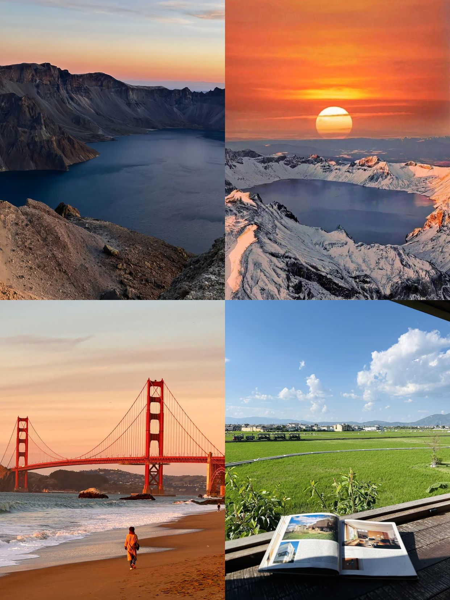
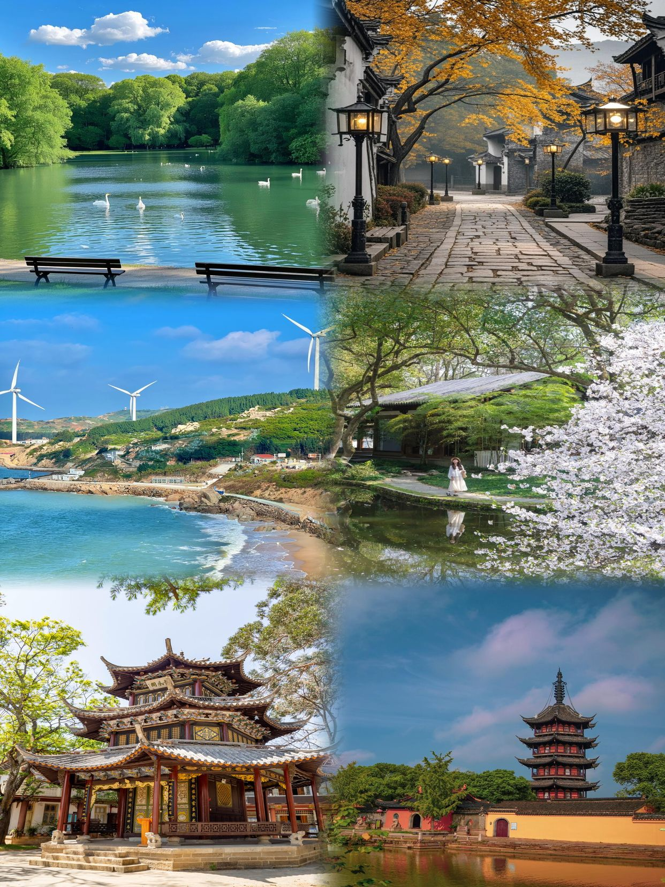
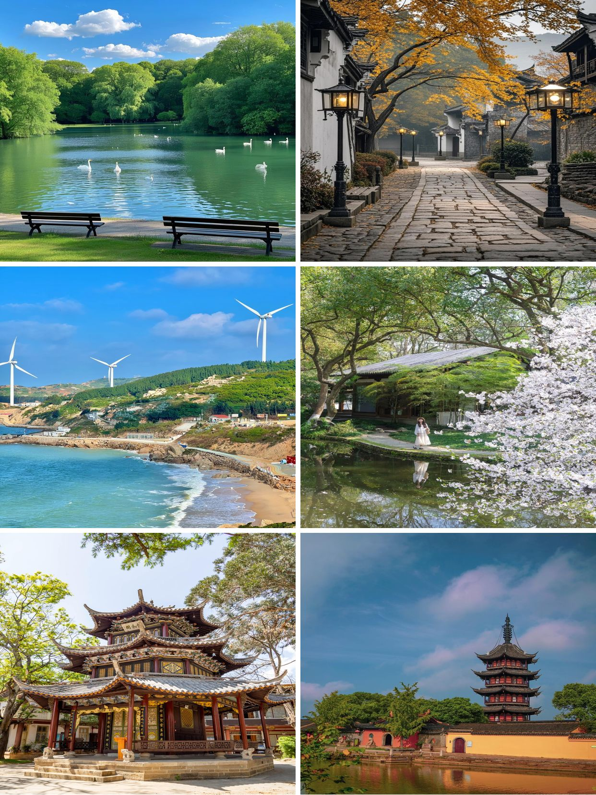
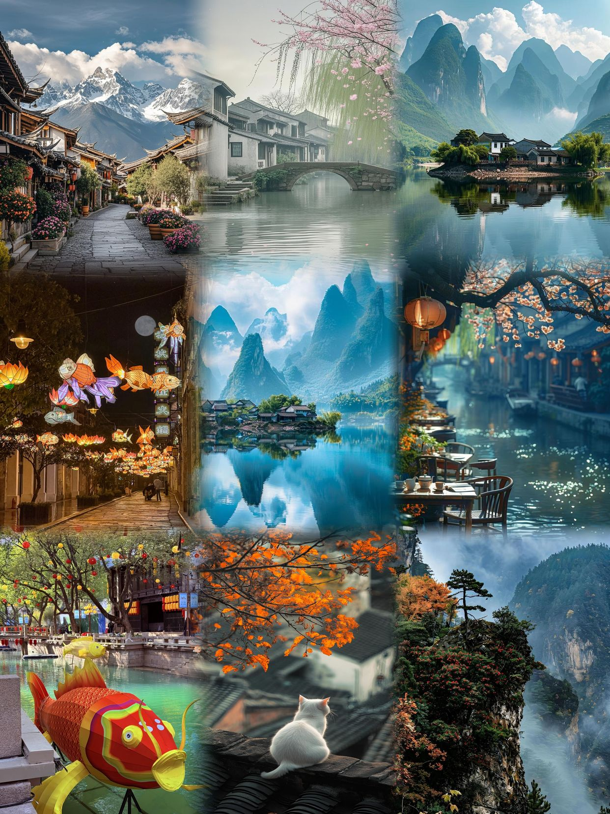
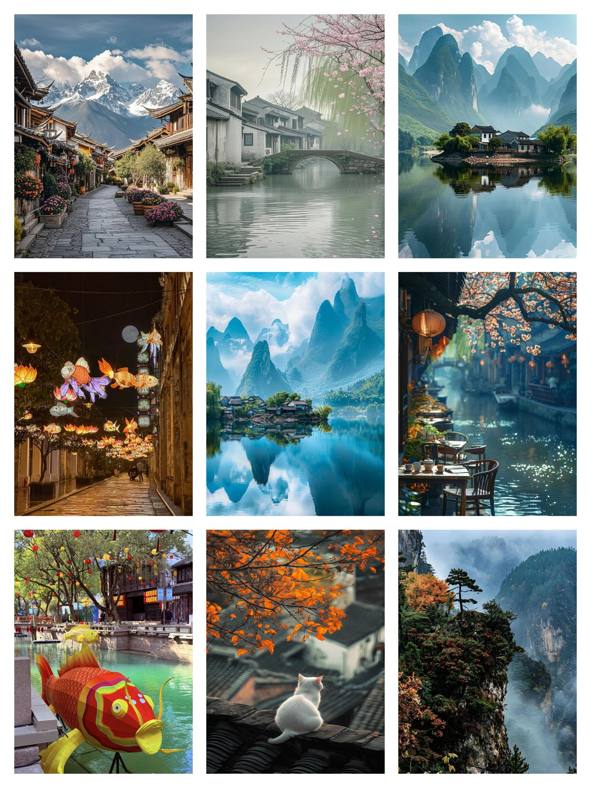

# ImageMergePro
Hapi Batch Image Merge Pro is designed to generate stitched images in batches.Generate hundreds of images with one click. Each time the tool performs image stitching, it extracts images one by one from the folders configured in the configuration interface and stitches them into a single image (without re-using images). Then, it optionally overlays custom text and saves the result in the specified output folder.

[Official Website](https://www.imagemerge.pro)

### 2x2 blur with text

### 2x2 normal 

### 2x1 blur

### 3x1 blur

### 3x2 blur

### 3x2 with space

### 3x3 blur

### 3x3 space and border

